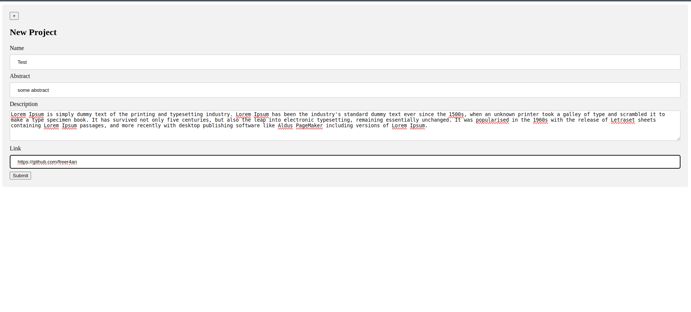
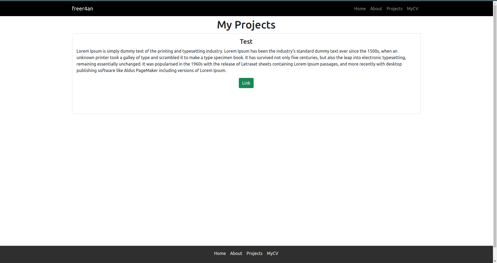
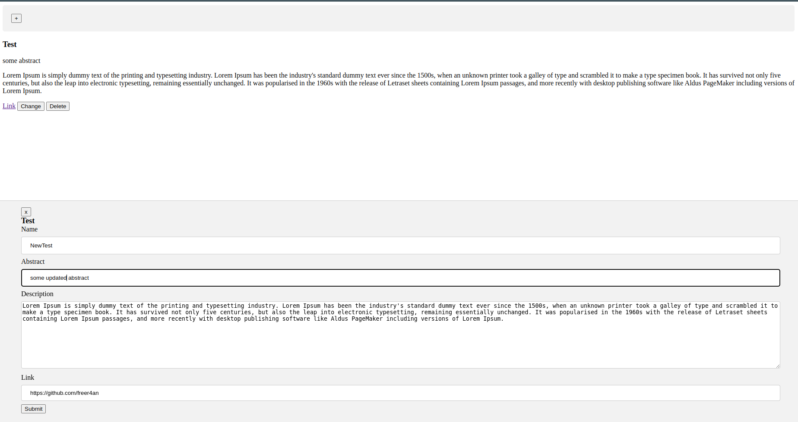
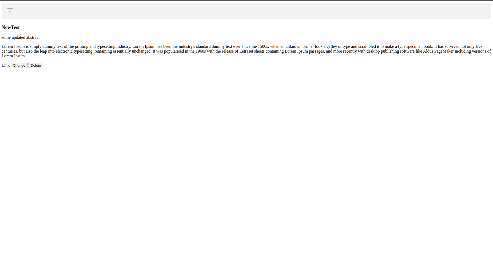

# portfolio-website

## Description
This is a portfolio website with an admin panel. From the admin panel you can manipulate projects and data of the author of the portfolio.

## Usage

Create ".env" file and define "login" and "password" for admin in .env
Make sure you have installed docker engine.

```console
sudo docker compose up
```
For now [projects](http://localhost:8000/projects) page is empty. So let's create projects.

### Admin panel
Login into admin panel [http://localhost:8000/login](http://localhost:8000/login)
Get username and password from ".env" you've created file.

### Create project
Click [+] on admin panel <br />

Result [projects](http://localhost:8000/projects) <br />


### Update project
Click update button of the project you want to update <br />

Result [projects](http://localhost:8000/projects) <br />


